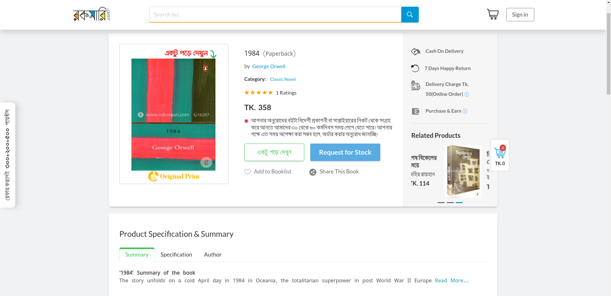
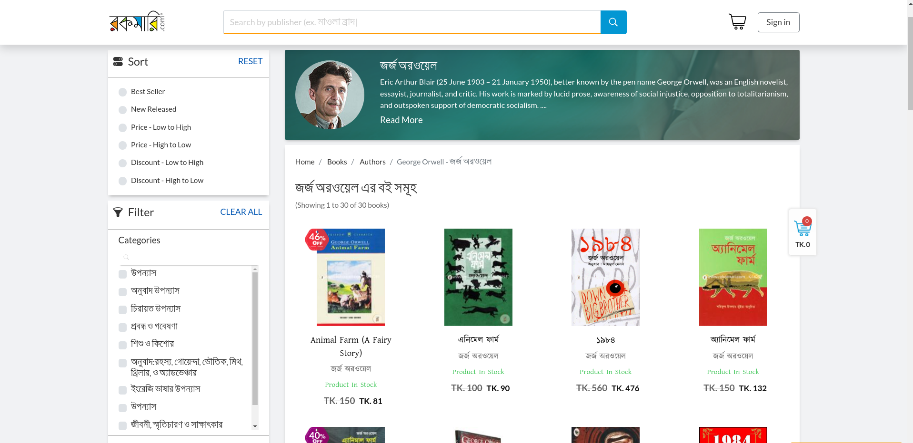

# Project Proposal for CSE 216 Database Sessional

**Title:** BookKeep

**Tools and Languages:** HTML, CSS, Bootstrap, Python(Django), Oracle

**Description:** Our project, BookKeep is an online book store and cataloging service where people can go and find their favourite books of almost any literary type and order the available ones, almost like [rokomari.com](rokomari.com). Here an user can -
- Search and filter out the books they are looking for
- Get useful information  about the books (like release date, reviews, author, publisher etc)
- Get all the relevant information and biography of the authors of their choice and their upcoming works
- Add books to their favourite list to keep track or use it like a wishlist
- Order books of their likings
- Get exciting offers
- Buy premium membership. Premium members can get more facilities than a regular user (like borrowing books without payment)

 Fig: A Demo UI of BookKeep  
  Reference: <a href="https://www.rokomari.com/book">https://www.rokomari.com/book</a>

---

<em>
- Md. Sultanul Arifin (1805097)  
Md. Asif Haider (1805112)
</em>

